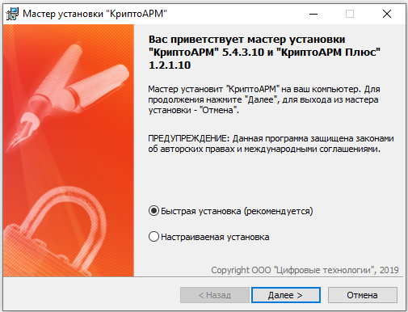

# Как установить КриптоАРМ?
Установка программы «КриптоАРМ» должна осуществляться пользователем, имеющим права Администратора системы.

Для установки программы «КриптоАРМ» запустите на исполнение файл **Trusted- Desktop х.х.exe** (где x.x. – номер версии). Откроется мастер установки «КриптоАРМ».

На этом шаге выберите вариант установки:
* **Быстрая установка** (рекомендуется).
Быстрая установка программы, включает все дополнительные компоненты. Требует наибольшего объема места на диске.
* **Настраиваемая установка**
Установка с выбором дополнительных компонентов (модулей к программе). Рекомендуется для опытных пользователей.

 