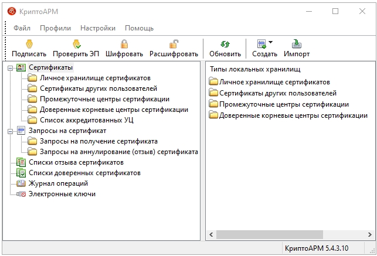

# Интерфейс программы
Вы можете работать с программой «КриптоАРМ», выбрав наиболее удобный для вас вариант:

* [Главное окно программы](#title1): предназначено для выполнения криптоопераций, а также управления криптопровайдерами, сертификатами и настройками программы
* [Значок на панели задач](#title2), который имеет контекстное меню с полным перечнем операций.
* [Проводник Windows](#title3) (контекстное меню файла)

## Главное окно программы
## 
В левой части главного окна расположено дерево объектов, которое включает в себя основные разделы: «Сертификаты», «Запросы на сертификат», «Списки отзыва сертификатов», «Списки доверенных сертификатов» и «Электронные ключи». В правой части главного окна отображаются объекты, входящие в разделы дерева из левой его части:

