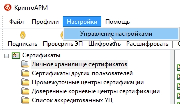

# Общие настройки
Настроить базовые параметры программы вы можете через главное окно программы.

Для этого выполните следующие шаги:
На верхней панели главного окна откройте меню **Настройки - Управление настройками:**

